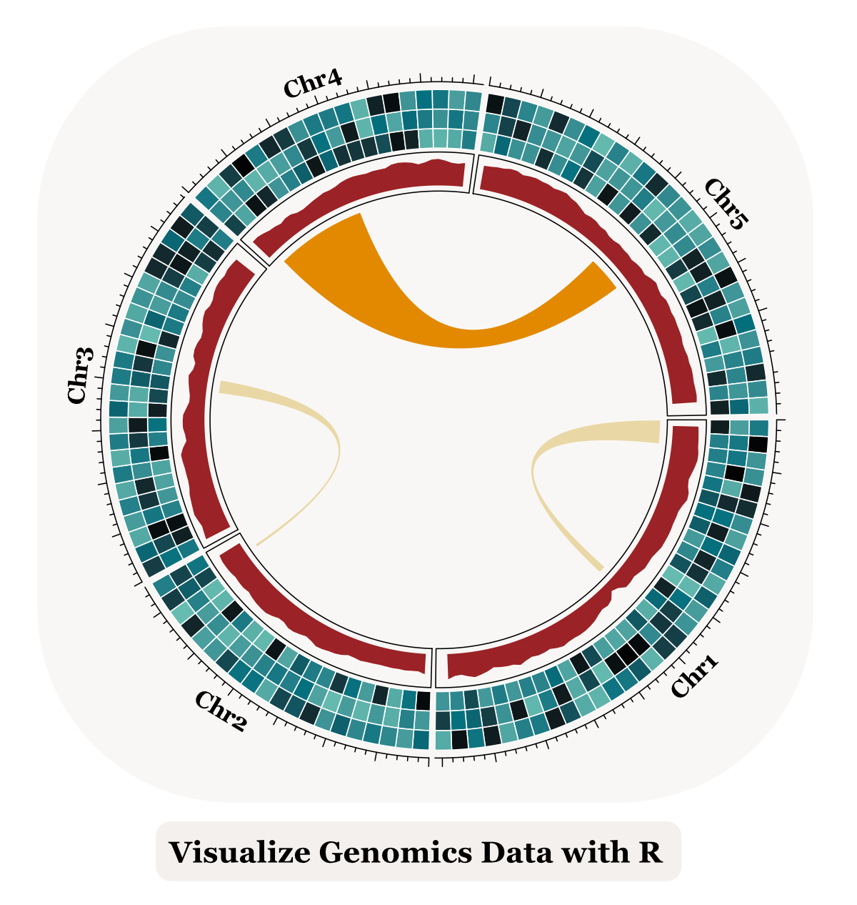

[](https://opensource.org/licenses/MIT)
[](https://github.com/loukesio/dataviz-genomicsdata/graphs/traffic)

[](https://github.com/loukesio/dataviz-genomicsdata/issues)
[](https://github.com/loukesio/dataviz-genomicsdata/network/members)
[](https://github.com/loukesio/dataviz-genomicsdata/stargazers)

## Instructions for Setting Up the LearnGenViz Package for the Course

 

Follow these steps to clone the course repository, set up the LearnGenViz package, and install all dependencies using renv:

### 1. Clone the Course Repository

Start by cloning the LearnGenViz course repository from GitHub to your local machine. Run this command in your terminal (or use a Git client):
```bash
# Clone the repository
git clone git@github.com:loukesio/dataviz-genomicsdata.git

# Navigate to the cloned repository
cd dataviz-genomicsdata
```
### 2. Open the Project in RStudio

- Open RStudio.

- Go to **File > Open Project** and select the `DataGenomics.Rproj` file in the `dataviz-genomicsdata` directory.

Note: <br>
This step activates the renv environment, which helps manage the project's dependencies.

### 3. Restore the Project Environment

Run the following command in the R console to install all the packages specified in the renv.lock file:
```
renv::restore()
```
Note: <br>
This command ensures that all required packages (and their correct versions) are installed automatically. This step may take some time, as it downloads and installs packages as specified in the renv.lock file.

### 4. Load the LearnGenViz Package

Once the environment has been restored, load the LearnGenViz package:
```
library(LearnGenViz)
```

### Additional Information
- Dependencies: renv will handle the installation of all CRAN, Bioconductor, and GitHub packages required for the course.
- Project-specific Libraries: The renv package will create a project-specific library, ensuring that your environment matches the course setup.

### Troubleshooting
If you encounter any issues:

- Ensure you have the latest version of R and RStudio installed.
- Verify that git is installed on your system for cloning the repository.
- Contact me at theodosiou@evolbio.mpg.de for assistance with any errors during the setup.

By following these steps, you'll have the LearnGenViz package and all required dependencies set up for the course.


