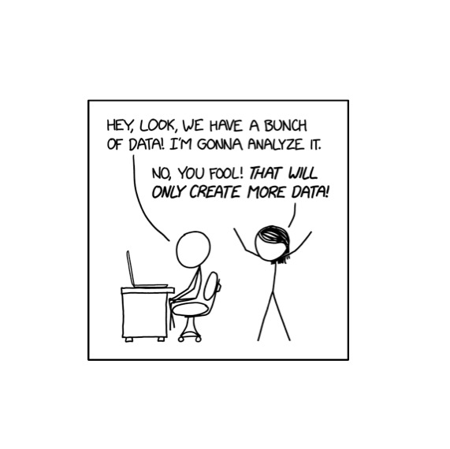
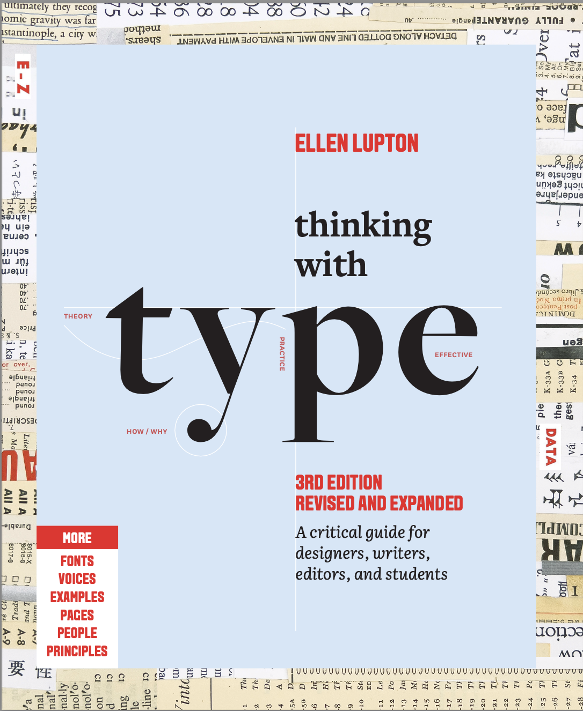
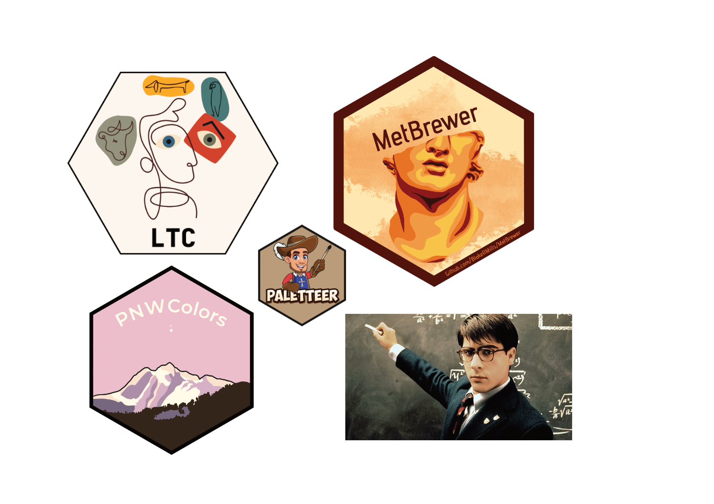
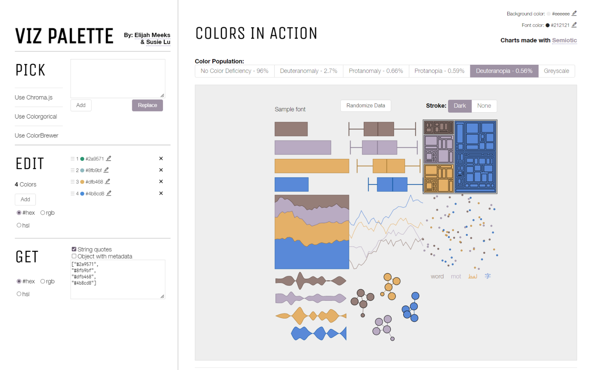
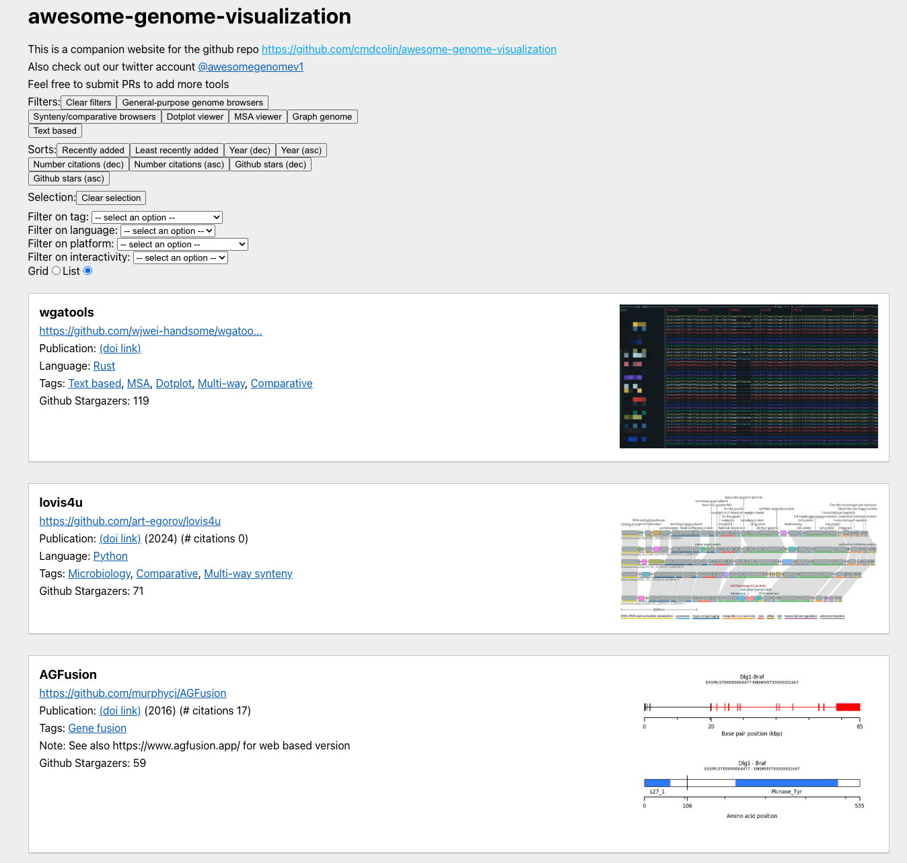

```{r}
#| label: setup
#| include: false
#| cache: false
library(readr)
library(dplyr)
library(ggplot2)
library(patchwork)
library(pheatmap)
library(MetBrewer)
library(RColorBrewer)
library(datasauRus)
library(gt)
library(tidyr)
library(tidygraph)
library(ggforce)

# Define a custom theme function for ggplot2 to enhance plot aesthetics
custom_theme <- function(base_size = 12, title_size_rel = 1.5,
                         subtitle_size_rel = 1.25,
                         axis_title_size_rel = 1.25, 
                         axis_text_size_rel = 1.25, 
                         strip_text_size_rel = 1.1) {
  # Use the theme_bw base theme with a specified font family ("Asap")
  theme_bw(base_size = base_size, base_family = "Asap") +
    theme(
      # Customize the title: center-align and set relative size
      plot.title = element_text(hjust = 0.5, size = rel(title_size_rel)),
      # Customize the subtitle: center-align and set relative size
      plot.subtitle = element_text(hjust = 0.5, size = rel(subtitle_size_rel)),
      # Customize the x-axis title: set size and add a top margin
      axis.title.x = element_text(size = rel(axis_title_size_rel), 
                                  margin = margin(t = 12.5)),
      # Customize the y-axis title: set size and add a right margin
      axis.title.y = element_text(size = rel(axis_title_size_rel), 
                                  margin = margin(r = 12.5)),
      # Customize the x-axis text: set size
      axis.text.x = element_text(size = rel(axis_text_size_rel)),
      # Customize the y-axis text: set size
      axis.text.y = element_text(size = rel(axis_text_size_rel)),
      # Customize facet strip text size
      strip.text = element_text(size = rel(strip_text_size_rel)),
      # Add margins around the plot t,r,b,l
      plot.margin = unit(c(2, 2, 1, 1), "cm"),
      # Remove major grid lines on the x-axis
      panel.grid.major.x = element_blank(),
      panel.grid.major.y  = element_blank(),
      # Remove minor grid lines
      panel.grid.minor.x = element_blank(),
      panel.grid.minor.y = element_line(
      linetype = "dashed",
      linewidth = 0.3,
      colour = "grey80"
      ),      # Remove background from facet strips
      strip.background = element_blank()
    )
}

theme_set(custom_theme())

# rel() means "relative to the base font size"
#
# Example:
# base_size = 12
# size = rel(1.25)  →  12 × 1.25 = 15
#
# Why use rel()?
# - Keeps typography scalable
# - Changing base_size updates the entire theme proportionally
# - Prevents hard-coded font sizes that break consistency
#
# rel() is especially useful for:
# - Titles
# - Subtitles
# - Axis labels
# - Facet strip text

```

```{=html}
<!-- 

slide 2  

-->
```

# Why do we need data visualisations? {background-color="#28A87D"}

```{=html}
<!-- 

slide 3  

-->
```

## Anscombe's Quartet

:::::::::::::::::::::::::::::::::::::: columns
:::: {.column width="45%"}
Four datasets with identical statistics:

-   Same means
-   Same variance\
-   Same correlation (0.816)
-   Same regression line

::: {.fragment .fade-in}
**Why does this matter?**

Anscombe's Quartet shows why plotting data is essential—summary statistics alone can hide crucial patterns.
:::
::::

::: {.column width="55%"}
```{r}
#| echo: false
#| fig-width: 6.5
#| fig-height: 5

anscombe_long <- anscombe |>
  mutate(observation = 1:n()) |>
  tidyr::pivot_longer(
    cols = -observation,
    names_to = c(".value", "set"),
    names_pattern = "(.)(.)"
  )

ggplot(anscombe_long, aes(x = x, y = y)) +
  geom_point(color = "#28A87D", size = 3.5, alpha = 0.7) +
  geom_smooth(method = "lm", se = FALSE, color = "#1E8B68", linewidth = 1.2) +
  facet_wrap(~set, labeller = labeller(set = \(x) paste("Dataset", x)))
```
:::
::::::::::::::::::::::::::::::::::::::

::: {.footer style="font-size: 0.7em; color: #606060; margin-top: 1em;"}
Source: Anscombe, F. J. (1973). Graphs in Statistical Analysis. *The American Statistician*, 27(1), 17–21.
:::

```{=html}
<!-- 

slide 4

-->
```

## The Datasaurus Dozen

All 13 datasets have nearly identical summary statistics but vastly different distributions!


```{r}
#| echo: false
#| fig-width: 14
#| fig-height: 7.5
#| fig-align: center
#| message: false
#| warning: false

# Install datasauRus if needed: install.packages("datasauRus")
library(datasauRus)

# Get the datasaurus data
dino_data <- datasaurus_dozen

# Create the plot
ggplot(dino_data, aes(x = x, y = y, colour = dataset)) +
  geom_point(size = 1.5, alpha = 0.7) +
  facet_wrap(~dataset, ncol = 5) +
  scale_color_manual(values = rep(c("#28A87D", "#FFD166", "#7BC5A8"), length.out = 13)) +
  labs(
    title = "The Datasaurus Dozen: Identical Statistics, Different Shapes",
    subtitle = "Each dataset has the same mean, standard deviation, and correlation"
  ) +
  theme(
    legend.position = "none",
    axis.text = element_blank(),
    axis.ticks = element_blank(),
    axis.title = element_blank()
  )
```

::: {.footer style="font-size: 0.7em; color: #606060;"}
Source: Matejka & Fitzmaurice (2017). [Same Stats, Different Graphs](https://www.research.autodesk.com/publications/same-stats-different-graphs/). ACM CHI 2017.
:::

```{=html}
<!-- 

slide 5  

-->
```

## The Datasaurus Dozen: Summary Statistics

::: {.center}
**All datasets have nearly identical statistics!**
:::
```{r}
#| echo: false
#| message: false
#| warning: false


# Calculate summary statistics for each dataset
summary_stats <- datasaurus_dozen |>
  group_by(dataset) |>
  summarise(
    Mean_X = mean(x),
    Mean_Y = mean(y),
    SD_X = sd(x),
    SD_Y = sd(y),
    Correlation = cor(x, y),
    .groups = "drop"
  ) |>
  arrange(dataset)

# Create beautiful gt table
summary_stats |>
  gt() |>
  tab_header(
    title = "Summary Statistics Across All 13 Datasets",
    subtitle = "Notice how similar the values are despite vastly different shapes"
  ) |>
  cols_label(
    dataset = "Dataset",
    Mean_X = "Mean X",
    Mean_Y = "Mean Y",
    SD_X = "SD X",
    SD_Y = "SD Y",
    Correlation = "Correlation"
  ) |>
  fmt_number(
    columns = c(Mean_X, Mean_Y, SD_X, SD_Y, Correlation),
    decimals = 2
  ) |>
  data_color(
    columns = c(Correlation),
    colors = scales::col_numeric(
      palette = c("#E8F5F1", "#28A87D"),
      domain = NULL
    )
  ) |>
  tab_style(
    style = cell_text(weight = "bold"),
    locations = cells_column_labels()
  ) |>
  tab_style(
    style = cell_text(size = px(12)),
    locations = cells_body()
  ) |>
  tab_options(
    table.font.size = px(14),
    heading.title.font.size = px(18),
    heading.subtitle.font.size = px(14),
    table.width = pct(90),
    table.align = "center"
  ) 
```

::: {.footer style="font-size: 0.7em; color: #606060;"}
Source: Matejka & Fitzmaurice (2017). [Same Stats, Different Graphs](https://www.research.autodesk.com/publications/same-stats-different-graphs/). ACM CHI 2017.
:::

```{=html}
<!-- 

slide 6  

-->
```

## The Datasaurus Dozen: Visual Comparison

All 13 datasets have nearly identical summary statistics but vastly different distributions!
```{r}
#| echo: false
#| fig-width: 14
#| fig-height: 7.5
#| fig-align: center
#| message: false
#| warning: false

# Get the datasaurus data
dino_data <- datasaurus_dozen

# Create the plot
ggplot(dino_data, aes(x = x, y = y, colour = dataset)) +
  geom_point(size = 1.5, alpha = 0.7) +
  facet_wrap(~dataset, ncol = 5) +
  scale_color_manual(values = rep(c("#28A87D", "#FFD166", "#7BC5A8"), length.out = 13)) +
  labs(
    title = "The Datasaurus Dozen: Identical Statistics, Different Shapes",
    subtitle = "Each dataset has the same mean, standard deviation, and correlation"
  ) +
  theme(
    legend.position = "none",
    axis.text = element_blank(),
    axis.ticks = element_blank(),
    axis.title = element_blank()
  )
```

::: {.footer style="font-size: 0.7em; color: #606060;"}
Source: Matejka & Fitzmaurice (2017). [Same Stats, Different Graphs](https://www.research.autodesk.com/publications/same-stats-different-graphs/). ACM CHI 2017.
:::

```{=html}
<!-- 

slide 7 

-->
```

# Big data in biology {background-color="#28A87D"}

```{=html}
<!-- 

slide 8 

-->
```

## The Genomics Data Explosion

:::::: columns
:::: {.column width="50%"}

- <span style="color: #606060;">**1 to 2 exabytes** of data is produced on Youtube per year</span>

- <span style="color: #28A87D; font-weight: 700;">220 million genomes</span> of data produced <span style="color: #28A87D; font-weight: 700;">per year</span>

- Equivalent to <span style="color: #606060; font-weight: 700;">40 exabytes</span> per year

- That's more than <span style="color: #28A87D; font-weight: 700;">20 times</span> higher than the data Youtube produces

::: fragment
For years we struggled to collect biological data, but now our biggest bottleneck is <span class="simple-highlight-ylw" style="font-weight: 700;">analyzing and interpreting it</span>
:::

::::

::: {.column width="50%"}
  {width="100%"}
:::
::::::


```{=html}
<!-- 
slide 9
-->
```

## Understanding Genomic Data Visualization

**Why visualization matters in genomics:**

- **Generate insights**: Reveal patterns and relationships that drive new research questions
- **Clarify complex results**: Transform dense analytical outputs into understandable visuals
- **Share discoveries**: Present findings effectively to diverse audiences

::: {.footer style="font-size: 0.7em; color: #606060;"}
Adapted from genomics visualization best practices
:::
```{=html}
<!-- 
slide 10
-->
```
## Challenges in Genomic Visualization

**Scale & Structure**

- Visualizing from genome-wide to nucleotide resolution
- Balancing overview and detailed views
- Representing non-linear genomic interactions

::: fragment
**Data Complexity**

- Integrating multiple data types (expression, variants, structure)
- Managing high-dimensional datasets
- Maintaining clarity with dense information
:::

::: {.footer style="font-size: 0.7em; color: #606060;"}
Common challenges in bioinformatics visualization
:::


```{=html}
<!-- 
slide 11
-->
```

## Key Visualization Goals

**Compare & Contrast**

- Identify significant genomic regions
- Compare features across samples
- Detect differences and similarities

::: fragment
**Explore & Discover**

- Search for specific features
- Identify patterns in data
- Summarize trends across datasets
:::

```{=html}
<!-- 
slide 12
-->
```

## Typography for Scientific Presentations

**Font categories and their applications:**
```{r}
#| echo: false
#| message: false
library(gt)
library(dplyr)

font_guide <- tibble(
  Category = c("Sans Serif", "Serif", "Slab Serif", "Monospace", "Display"),
  Characteristics = c(
    "Clean lines, modern appearance",
    "Traditional, formal aesthetic",
    "Bold serifs, strong presence",
    "Fixed-width characters",
    "Decorative, distinctive styles"
  ),
  `Best Used For` = c(
    "Screen content, presentations",
    "Reports, publications",
    "Headings, emphasis",
    "Code, technical specs",
    "Titles, branding"
  ),
  Examples = c(
    "Asap, Helvetica, Arial",
    "Georgia, Times, Literata",
    "Rockwell, Courier",
    "Consolas, Monaco",
    "Custom display fonts"
  )
)

font_guide |>
  gt() |>
  cols_align(align = "left") |>
  tab_style(
    style = cell_text(weight = "bold", size = px(14)),
    locations = cells_column_labels()
  ) |>
  tab_style(
    style = cell_text(size = px(12)),
    locations = cells_body()
  ) |>
  tab_options(
    table.font.size = px(13),
    table.width = pct(95)
  )
```

<br>

::: {style="text-align: center; margin-top: 0.5em;"}
{width="15%"}

**Recommended reading:** Ellen Lupton's "Thinking with Type"
:::

::: {.footer style="font-size: 0.7em; color: #606060;"}
Typography principles adapted from Ellen Lupton's design guidance
:::


```{=html}
<!-- 
slide 13
-->
```

## Color Palettes in R

:::::: columns
::: {.column width="50%"}
{width="100%"}
:::

::: {.column width="50%"}
**R Packages for Color Palettes:**

::: fragment
**Built-in & Popular:**

- `RColorBrewer` - ColorBrewer palettes
- `viridis` - Perceptually uniform, colorblind-friendly
- `ggsci` - Scientific journal color schemes
:::

::: fragment
**Specialized:**

- `MetBrewer` - Metropolitan Museum of Art palettes
- `wesanderson` - Wes Anderson movie palettes
- `paletteer` - Meta-package (1000+ palettes)
- `colorspace` - Manipulation & generation
:::

::: fragment
**For Genomics:**

- `genefilter` - Heatmap colors
- `ComplexHeatmap` - Advanced color schemes
:::
:::
::::::

::: {.footer style="font-size: 0.7em; color: #606060;"}
Choose palettes based on data type and accessibility needs
:::
```{=html}
<!-- 
slide 14
-->
```

## Colorblind-Friendly Design

:::::: columns
::: {.column width="60%"}
[{width="100%"}](https://www.vizwiz.com/p/viz-palette.html)
:::

::: {.column width="40%"}
**Why it matters:**

- ~8% of men have color vision deficiency
- ~0.5% of women affected
- Most common: red-green colorblindness

::: fragment
**Best practices:**

✅ Use colorblind-safe palettes  
✅ Add texture/patterns  
✅ Use sufficient contrast  
✅ Test with simulators  
✅ Don't rely on color alone
:::

::: fragment
**Tools to check:**

- [Viz Palette](https://www.vizwiz.com/p/viz-palette.html) (click image)
- ColorBrewer "colorblind safe" option
- `colorspace::deutan()` simulator
:::
:::
::::::

::: {.footer style="font-size: 0.7em; color: #606060;"}
Click image to access Viz Palette colorblind simulator
:::

## Color Palette Fundamentals

**Creating effective color schemes for data:**
```{r}
#| label: color-palette-basics
# Define a custom palette
primary_colors <- c("#28A87D", "#A83D28", "#2853a8")
```

:::::: columns
:::: {.column width="50%"}
```{r}
#| echo: false
#| fig-height: 5
colorspace::demoplot(primary_colors, type = "pie")
```
::::

:::: {.column width="50%"}
```{r}
#| echo: false
#| fig-height: 5
colorspace::demoplot(primary_colors, type = "bar")
```
::::
::::::

::: {.footer style="font-size: 0.7em; color: #606060;"}
Color palette demonstration using colorspace package
:::
```{=html}
<!-- 
slide 14
-->
```

## Sequential Color Palettes

**For ordered data (low to high values):**
```{r}
#| label: sequential-palette
# Create gradient from color to neutral
seq_colors <- c("#28A87D", "grey98")
sequential_pal <- colorRampPalette(seq_colors)(35)
```

:::::: columns
:::: {.column width="50%"}
```{r}
#| echo: false
#| fig-height: 4.5
colorspace::demoplot(sequential_pal, type = "map")
```
::::

:::: {.column width="50%"}
```{r}
#| echo: false
#| fig-height: 4.5
colorspace::demoplot(sequential_pal, type = "heatmap")
```
::::
::::::

**Use for:** Expression levels, read depth, quality scores
```{=html}
<!-- 
slide 15
-->
```

## Diverging Color Palettes

**For data with a meaningful midpoint:**
```{r}
#| label: diverging-palette
# Create diverging palette through neutral center
div_colors <- c("#7754BF", "grey98", "#208462")
diverging_pal <- colorRampPalette(div_colors)(35)
```

:::::: columns
:::: {.column width="50%"}
```{r}
#| echo: false
#| fig-height: 4.5
colorspace::demoplot(diverging_pal, type = "map")
```
::::

:::: {.column width="50%"}
```{r}
#| echo: false
#| fig-height: 4.5
colorspace::demoplot(diverging_pal, type = "heatmap")
```
::::
::::::

**Use for:** Log fold changes, correlation values, z-scores
```{=html}
<!-- 
slide 16
-->
```

## Adjusting Color Intensity

**Darken colors for better contrast:**
```{r}
#| label: color-adjustment
# Darken primary color for emphasis
dark_colors <- c(colorspace::darken("#28A87D", .35), "grey98")
adjusted_pal <- colorRampPalette(dark_colors)(35)
```

:::::: columns
:::: {.column width="50%"}
```{r}
#| echo: false
#| fig-height: 4.5
colorspace::demoplot(adjusted_pal, type = "map")
```
::::

:::: {.column width="50%"}
```{r}
#| echo: false
#| fig-height: 4.5
colorspace::demoplot(adjusted_pal, type = "heatmap")
```
::::
::::::

**Tip:** Use `darken()` or `lighten()` to adjust color intensity
```{=html}
<!-- 
slide 17
-->
```

## Color Space Options

**Different color spaces affect adjustments differently:**

- **HCL (perceptual)**: Adjusts luminance while maintaining hue and chroma
- **HLS (traditional)**: Modifies lightness component directly  
- **Combined**: Adjusts luminance in HCL but chroma in HLS
```{r}
#| label: color-space-comparison
# Compare color spaces
hcl_adjusted <- colorspace::darken("#28A87D", .35, space = "HCL")
hls_adjusted <- colorspace::darken("#28A87D", .35, space = "HLS")
```

**Recommendation:** Use HCL for perceptually uniform adjustments

::: {.footer style="font-size: 0.7em; color: #606060;"}
Color adjustment using the colorspace package
:::

```{=html}
<!-- 
slide 15
-->
```

## Genomic Visualization Resources

:::::: columns
::: {.column width="50%"}
[{width="100%"}](https://cmdcolin.github.io/awesome-genome-visualization/?latest=true)
:::

::: {.column width="50%"}
**Awesome Genome Visualization**

A curated collection of tools and resources

::: fragment
**Categories:**

- Genome browsers (IGV, JBrowse, UCSC)
- Circular plots (Circos, OmicCircos)
- Synteny viewers (SynVisio, MCScanX)
- Variant viewers (ProteinPaint, cBioPortal)
- R/Python packages
:::

::: fragment
**Why use it:**

- Discover specialized tools
- Compare features
- Find tutorials and examples
- Stay updated with latest tools
:::

::: fragment
**Click the image** to explore the collection →
:::
:::
::::::

::: {.footer style="font-size: 0.7em; color: #606060;"}
Maintained by Colin Diesh | Click image to visit: https://cmdcolin.github.io/awesome-genome-visualization
:::


# How are we going to work? {background-color="#28A87D"}

```{=html}
<!-- 

slide 20

-->
```
## Course Structure

**1. Presentations** – I'll present the material, and you're welcome to ask questions throughout or at the end

-   Presentation slides are included in your course materials

::: fragment
**2. Live demonstrations** – Focus on observing and taking notes; you'll have time to practice later
:::

::: fragment
**3. Hands-on practice** – Work through exercises at your own pace with support available

-   All tutorials and datasets are provided in interactive HTML format
-   Practical exercises included to reinforce concepts
:::

```{=html}
<!-- 
slide 19
-->
```

# Introduction to ggplot2 {background-color="#28A87D"}
```{=html}
<!-- 
slide intro2
-->
```

## The Grammar of Graphics

:::::: columns
::: {.column width="50%"}
**ggplot2 Philosophy:**

Building plots layer by layer

::: fragment
**Core concept:**

> "A plot is built up from simple components: **data**, **aesthetics**, **geometries**, **themes**"

— Hadley Wickham
:::

::: fragment
**Why ggplot2?**

✅ Consistent syntax  
✅ Highly customizable  
✅ Publication-quality graphics  
✅ Extensive ecosystem
:::
:::

::: {.column width="50%"}
::: fragment
```{r}
#| echo: false
#| fig-width: 6
#| fig-height: 5

library(ggplot2)
set.seed(123)
demo_data <- data.frame(
  x = rnorm(100, 50, 10),
  y = rnorm(100, 50, 10),
  group = sample(c("A", "B"), 100, replace = TRUE)
)

cross_colors <- met.brewer("Cross", 5)

ggplot(demo_data, aes(x = x, y = y, color = group)) +
  geom_point(size = 3, alpha = 0.7) +
  scale_color_manual(values = c(cross_colors[1], cross_colors[3])) +
  labs(title = "Built with Layers") +
  theme(legend.position = "bottom")
```
:::
:::
::::::

::: {.footer style="font-size: 0.7em; color: #606060;"}
Tutorial inspiration: Cédric Scherer's ggplot2 guide
:::
```{=html}
<!-- 
slide intro3
-->
```

## The Layered Structure of ggplot2

**Every plot has these components:**
```{r}
#| echo: true
#| eval: false
#| code-line-numbers: "1-2|4-5|7-8|10-11|13-14"

# 1. DATA - What you want to visualize
ggplot(data = my_data)

# 2. AESTHETICS - Map variables to visual properties
     aes(x = variable1, y = variable2, color = group)

# 3. GEOMETRIES - How to represent the data
     + geom_point()   # scatter plot
     + geom_line()    # line plot
     + geom_bar()     # bar chart

# 4. SCALES - Control the mapping (colors, axes)
     + scale_color_manual(values = c("red", "blue"))

# 5. THEME - Non-data ink (titles, labels, appearance)
     + labs(title = "My Plot") + theme_minimal()
```

**Think of it as:** DATA + AESTHETICS + GEOMETRY + SCALES + THEME
```{=html}
<!-- 
slide intro4
-->
```

```{=html}
<!-- 
slide intro4a
-->
```

## Building a Plot: Step 1

**Start with data and aesthetics:**
```{r}
#| echo: true
#| eval: false

# Define what to plot
ggplot(data = iris, 
       aes(x = Sepal.Length, 
           y = Sepal.Width))
```

**What this creates:**
```{r}
#| echo: false
#| fig-width: 10
#| fig-height: 5
#| fig-align: center

ggplot(iris, aes(x = Sepal.Length, y = Sepal.Width)) +
  labs(
    title = "Step 1: Data + Aesthetics Defined",
    subtitle = "Axes are set up, but no geometry to display the data yet",
    x = "Sepal Length (cm)",
    y = "Sepal Width (cm)"
  )
```

**Result:** Empty canvas with axes - we've told ggplot *what* to plot, but not *how*
```{=html}
<!-- 
slide intro4b
-->
```

## Building a Plot: Step 2

**Add geometry to display the data:**
```{r}
#| echo: true
#| eval: false

ggplot(iris, 
       aes(x = Sepal.Length, 
           y = Sepal.Width)) +
  geom_point()  # Add points!
```

**What this creates:**
```{r}
#| echo: false
#| fig-width: 10
#| fig-height: 5
#| fig-align: center

ggplot(iris, aes(x = Sepal.Length, y = Sepal.Width)) +
  geom_point(size = 2.5, alpha = 0.7) +
  labs(
    title = "Step 2: Geometry Added",
    subtitle = "Now we can see the data as points",
    x = "Sepal Length (cm)",
    y = "Sepal Width (cm)"
  )
```

**Result:** Data appears as points - the `+` operator adds layers to the plot
```{=html}
<!-- 
slide intro4c
-->
```

## Building a Plot: Step 3

**Add color to distinguish groups:**
```{r}
#| echo: true
#| eval: false

ggplot(iris, 
       aes(x = Sepal.Length, 
           y = Sepal.Width,
           color = Species)) +  # Map Species to color
  geom_point(size = 3, alpha = 0.7)
```

**What this creates:**
```{r}
#| echo: false
#| fig-width: 10
#| fig-height: 5
#| fig-align: center

ggplot(iris, aes(x = Sepal.Length, y = Sepal.Width, color = Species)) +
  geom_point(size = 3, alpha = 0.7) +
  labs(
    title = "Step 3: Color by Species",
    subtitle = "ggplot2 automatically assigns colors and creates a legend",
    x = "Sepal Length (cm)",
    y = "Sepal Width (cm)"
  ) +
  theme(legend.position = "right")
```

**Result:** Species are now distinguished by color - ggplot2 chose default colors
```{=html}
<!-- 
slide intro4d
-->
```

## Building a Plot: Step 4

**Customize with Cross color palette:**
```{r}
#| echo: true
#| eval: false

cross_colors <- met.brewer("Cross", 3)

ggplot(iris, 
       aes(x = Sepal.Length, y = Sepal.Width, color = Species)) +
  geom_point(size = 3, alpha = 0.7) +
  scale_color_manual(values = cross_colors) +  # Our colors!
  labs(title = "Iris Sepal Measurements",
       x = "Sepal Length (cm)", 
       y = "Sepal Width (cm)")
```

**What this creates:**
```{r}
#| echo: false
#| fig-width: 10
#| fig-height: 5
#| fig-align: center

cross_colors <- met.brewer("Cross", 3)

ggplot(iris, aes(x = Sepal.Length, y = Sepal.Width, color = Species)) +
  geom_point(size = 3, alpha = 0.7) +
  scale_color_manual(values = cross_colors) +
  labs(
    title = "Step 4: Custom Color Palette",
    subtitle = "Using MetBrewer Cross palette",
    x = "Sepal Length (cm)",
    y = "Sepal Width (cm)"
  ) +
  theme(legend.position = "right")
```

**Result:** Professional colors from the Cross palette
```{=html}
<!-- 
slide intro4e
-->
```

## Building a Plot: Step 5 (Bonus)

**Create your own diverging palette with colorspace:**
```{r}
#| echo: true
#| eval: false

# Create custom diverging palette
library(colorspace)
div_colors <- c("#7754BF", "grey98", "#208462")
my_palette <- colorRampPalette(div_colors)(3)

ggplot(iris, 
       aes(x = Sepal.Length, y = Sepal.Width, color = Species)) +
  geom_point(size = 3, alpha = 0.7) +
  scale_color_manual(values = my_palette) +  # Custom colors!
  labs(title = "Iris Sepal Measurements",
       x = "Sepal Length (cm)", 
       y = "Sepal Width (cm)")
```

**What this creates:**
```{r}
#| echo: false
#| fig-width: 10
#| fig-height: 5
#| fig-align: center

div_colors <- c("#7754BF", "grey98", "#208462")
my_palette <- colorRampPalette(div_colors)(3)

ggplot(iris, aes(x = Sepal.Length, y = Sepal.Width, color = Species)) +
  geom_point(size = 3, alpha = 0.7) +
  scale_color_manual(values = my_palette) +
  labs(
    title = "Step 5: Custom Diverging Palette",
    subtitle = "Created with colorRampPalette() - purple to grey to green",
    x = "Sepal Length (cm)",
    y = "Sepal Width (cm)"
  ) +
  theme(legend.position = "right")
```

**Result:** Your own custom color scheme!
```{=html}
<!-- 
slide intro4f
-->
```

## Complete Code: All Steps Together
```{r}
#| echo: true
#| eval: false

# Step 1: Load libraries and prepare colors
library(ggplot2)
cross_colors <- met.brewer("Cross", 3)

# Steps 2-5: Build the plot layer by layer
ggplot(iris, 
       aes(x = Sepal.Length,        # Step 1: X variable
           y = Sepal.Width,          # Step 1: Y variable  
           color = Species)) +       # Step 3: Color by group
  geom_point(size = 3, alpha = 0.7) +  # Step 2: Add points
  scale_color_manual(values = cross_colors) +  # Step 4: Custom colors
  labs(
    title = "Iris Sepal Measurements",
    subtitle = "Comparing three species",
    x = "Sepal Length (cm)",
    y = "Sepal Width (cm)"
  ) +
  theme(legend.position = "bottom")
```

**Remember:** Each `+` adds a new layer - that's the power of ggplot2!
```{=html}
<!-- 
slide intro5
-->
```

## Common Geometries (geoms)

**Choose the right geom for your data type:**
```{r}
#| echo: false
#| fig-width: 13
#| fig-height: 6
#| fig-align: center

library(patchwork)

set.seed(456)
demo <- data.frame(
  category = rep(c("A", "B", "C"), each = 30),
  value = c(rnorm(30, 10, 2), rnorm(30, 15, 3), rnorm(30, 12, 2)),
  x = rep(1:30, 3),
  y = c(cumsum(rnorm(30, 0.1, 1)), cumsum(rnorm(30, 0.15, 1)), cumsum(rnorm(30, 0.12, 1)))
)

cross_colors <- met.brewer("Cross", 3)

p1 <- ggplot(demo, aes(x = category, y = value, fill = category)) +
  geom_boxplot(alpha = 0.7) +
  scale_fill_manual(values = cross_colors) +
  labs(title = "geom_boxplot()", subtitle = "Distributions") +
  theme(legend.position = "none")

p2 <- ggplot(demo, aes(x = x, y = y, color = category)) +
  geom_line(linewidth = 1.2) +
  scale_color_manual(values = cross_colors) +
  labs(title = "geom_line()", subtitle = "Trends over time") +
  theme(legend.position = "none")

p3 <- ggplot(demo |> group_by(category) |> summarise(mean_val = mean(value)), 
             aes(x = category, y = mean_val, fill = category)) +
  geom_col(alpha = 0.7) +
  scale_fill_manual(values = cross_colors) +
  labs(title = "geom_col()", subtitle = "Comparisons") +
  theme(legend.position = "none")

p4 <- ggplot(demo, aes(x = value, y = x, color = category)) +
  geom_point(alpha = 0.6, size = 2) +
  scale_color_manual(values = cross_colors) +
  labs(title = "geom_point()", subtitle = "Relationships") +
  theme(legend.position = "none")

(p1 | p2) / (p3 | p4)
```

**Most common:** `geom_point()`, `geom_line()`, `geom_bar()`, `geom_boxplot()`, `geom_violin()`, `geom_tile()`
```{=html}
<!-- 
slide intro6
-->
```

## Our Custom Theme

**We've created a consistent theme for all course plots:**
```{r}
#| echo: true
#| eval: false
#| code-line-numbers: "1-6|8-12|14-18|20-27"

# Define custom theme function
custom_theme <- function(base_size = 12, 
                         title_size_rel = 1.5,
                         axis_title_size_rel = 1.25) {
  
  # Start with theme_bw and Asap font
  theme_bw(base_size = base_size, base_family = "Asap") +
    theme(
      # Center and size titles
      plot.title = element_text(hjust = 0.5, 
                                size = rel(title_size_rel)),
      plot.subtitle = element_text(hjust = 0.5, 
                                   size = rel(subtitle_size_rel)),
      
      # Axis customization
      axis.title.x = element_text(size = rel(axis_title_size_rel), 
                                  margin = margin(t = 12.5)),
      axis.title.y = element_text(size = rel(axis_title_size_rel), 
                                  margin = margin(r = 12.5)),
      
      # Grid and margins
      panel.grid.major.x = element_blank(),
      panel.grid.minor.x = element_blank(),
      panel.grid.minor.y = element_line(linetype = "dashed",
                                        linewidth = 0.3,
                                        colour = "grey80"),
      plot.margin = unit(c(2, 2, 1, 1), "cm")
    )
}
```
```{=html}
<!-- 
slide intro7
-->
```

## Using the Custom Theme

**Set once, use everywhere:**

:::::: columns
::: {.column width="50%"}
```{r}
#| echo: true
#| eval: false

# Set as default theme for all plots
theme_set(custom_theme())

# Now all your plots use it automatically!
ggplot(data, aes(x, y)) +
  geom_point() +
  labs(title = "My Plot")
  # No need to add theme!
```

::: fragment
**Customize per plot if needed:**
```{r}
#| echo: true
#| eval: false

ggplot(data, aes(x, y)) +
  geom_point() +
  # Override specific elements
  theme(
    legend.position = "bottom",
    axis.text.x = element_text(angle = 45)
  )
```
:::
:::

::: {.column width="50%"}
```{r}
#| echo: false
#| fig-width: 6
#| fig-height: 5.5

ggplot(iris, aes(x = Sepal.Length, y = Sepal.Width, color = Species)) +
  geom_point(size = 3, alpha = 0.7) +
  scale_color_manual(values = met.brewer("Cross", 3)) +
  labs(
    title = "Using Custom Theme",
    subtitle = "Consistent, professional styling",
    x = "Sepal Length (cm)",
    y = "Sepal Width (cm)"
  ) +
  theme(legend.position = "bottom")
```
:::
::::::

::: {.footer style="font-size: 0.7em; color: #606060;"}
Our theme ensures all course visualizations have consistent, professional appearance
:::
```{=html}
<!-- 
slide intro8
-->
```

## Quick Exercise: Your First ggplot

::: {.question}
**Build a plot step-by-step:**
```{r}
#| echo: true
#| eval: false

# Use the mtcars dataset (built into R)
data(mtcars)

# Your tasks:
# 1. Create scatter plot: mpg (y) vs weight (x)
# 2. Color points by number of cylinders (cyl)
# 3. Add size based on horsepower (hp)
# 4. Use Cross color palette
# 5. Add title and axis labels
# 6. The custom theme is already applied!

# Start here:
ggplot(mtcars, aes(x = wt, y = mpg)) +
  # Add your layers...
  
# Bonus: Add a smooth trend line with geom_smooth()
```

**Expected time:** 5 minutes
:::
```{=html}
<!-- 
slide intro9
-->
```

## ggplot2 Resources

:::::: columns
::: {.column width="50%"}
**Essential Resources:**

::: fragment
📚 **Documentation:**

- [ggplot2 official docs](https://ggplot2.tidyverse.org/)
- [R Graph Gallery](https://r-graph-gallery.com/)
- [ggplot2 cheatsheet](https://rstudio.github.io/cheatsheets/data-visualization.pdf)
:::

::: fragment
🎨 **Tutorials:**

- [Cédric Scherer's tutorial](https://www.cedricscherer.com/2019/08/05/a-ggplot2-tutorial-for-beautiful-plotting-in-r/)
- [Data-to-Viz](https://www.data-to-viz.com/)
- [R for Data Science (Wickham)](https://r4ds.hadley.nz/)
:::
:::

::: {.column width="50%"}
::: fragment
**Extension Packages:**

- `patchwork` - Combine multiple plots
- `ggrepel` - Smart label placement
- `gganimate` - Animated plots
- `ggridges` - Ridge plots
- `ggforce` - Extra geoms
- `cowplot` - Publication themes
:::

::: fragment
**For Genomics:**

- `ggtree` - Phylogenetic trees
- `ggbio` - Genomic data
- `complexHeatmap` - Advanced heatmaps
:::
:::
::::::

::: {.footer style="font-size: 0.7em; color: #606060;"}
We'll use many of these throughout the course
:::

## Lets check ourselves
::: {.column width="40%"}
**Join PollEv**

1.  Go to **PollEv.com**
2.  Enter **loukastheo**
3.  Respond to activity
:::
::::::

```{=html}
<!-- 
slide 20
-->
```

# Common types of data visualization in biological sciences {background-color="#28A87D"}
```{=html}
<!-- 
slide 21
-->
```

## Learning Objectives

- Understand common visualization types used in omics and biological research

- Recognize characteristics of effective and impactful visualizations

- Identify common pitfalls and practices to avoid
```{=html}
<!-- 
slide 22
-->
```

# Scatter plot {background-color="#28A87D"}
```{=html}
<!-- 
slide 23
-->
```

## Scatter Plots for Relationships

:::::: columns
:::: {.column width="48%"}
**Purpose:** Visualize relationships between two continuous variables

**Key elements:**

- Point cloud shows data distribution
- Regression line indicates trend
- Ellipses show group separation
- Color distinguishes categories

**Code structure:**
```r
ggplot(data, aes(x, y, color = group)) +
  geom_point() +
  stat_ellipse() +
  theme()
```
::::

::: {.column width="52%"}
```{r}
#| echo: true
#| fig-width: 6
#| fig-height: 5.5
#| code-line-numbers: "1-7|9-15|17-22"

# Generate PCA-like data
set.seed(42)
pca_data <- data.frame(
  PC1 = rnorm(200, mean = 0, sd = 3),
  PC2 = rnorm(200, mean = 0, sd = 2),
  group = sample(c("Control", "Treatment"), 
                 200, replace = TRUE)
)

cross_colors <- met.brewer("Cross", 5)

ggplot(pca_data, aes(x = PC1, y = PC2, 
                     color = group)) +
  geom_point(size = 3.5, alpha = 0.65) +
  geom_vline(xintercept = 0, 
             linetype = "dashed", 
             color = "gray50") +
  geom_hline(yintercept = 0, 
             linetype = "dashed", 
             color = "gray50") +
  stat_ellipse(level = 0.95, linewidth = 1.2) +
  scale_color_manual(
    values = c(cross_colors[1], cross_colors[3]), 
    name = ""
  ) +
  labs(title = "PCA Plot - Genomic Features",
       x = "PC1 (44.3%)", y = "PC2 (28.1%)") +
  theme(legend.position = "bottom")
```
:::
::::::
```{=html}
<!-- 
slide 23a
-->
```

## Exercise: Create Your Own Scatter Plot

::: {.question}
**Coding Exercise**

Use this simulated gene expression dataset:
```{r}
#| echo: true
#| eval: false

# Simulate gene expression vs copy number data
set.seed(123)
gene_data <- data.frame(
  gene_id = paste0("Gene_", 1:100),
  expression = rnorm(100, mean = 50, sd = 15),
  copy_number = rnorm(100, mean = 2, sd = 0.5),
  mutation_status = sample(c("WT", "Mutant", "Deletion"), 
                          100, replace = TRUE, 
                          prob = c(0.6, 0.3, 0.1))
)

# Add correlation between expression and copy number
gene_data$expression <- gene_data$expression + 
  (gene_data$copy_number - 2) * 20 + rnorm(100, 0, 5)

# Your tasks:
# 1. Create scatter plot: expression (y) vs copy_number (x)
# 2. Color points by mutation_status
# 3. Add a regression line
# 4. Use Cross color palette
# 5. Add appropriate labels

# Bonus: Add confidence interval bands around regression line
```
:::

::: fragment
**Expected output:** Scatter plot showing positive correlation, colored by mutation status, with regression line
:::
```{=html}
<!-- 
slide 24
-->
```

# Bar chart {background-color="#28A87D"}
```{=html}
<!-- 
slide 25
-->
```

## Bar Charts for Comparisons

**Step-by-step code:**
```{r}
#| echo: true
#| eval: false
#| code-line-numbers: "1-10|12-17|19-28|30-36"

# Step 1: Generate data
set.seed(123)
dose_data <- data.frame(
  dose = rep(c("0.5", "1", "2"), each = 6),
  supplement = rep(c("OJ", "VC"), times = 9),
  length = c(
    rnorm(3, 13, 2), rnorm(3, 8, 1.5),
    rnorm(3, 23, 2), rnorm(3, 17, 2),
    rnorm(3, 26, 2), rnorm(3, 27, 2)
  )
)

# Step 2: Calculate summary statistics
dose_summary <- dose_data |>
  group_by(dose, supplement) |>
  summarise(mean_len = mean(length),
            sd_len = sd(length), .groups = "drop")

# Step 3: Create plot
cross_colors <- met.brewer("Cross", 5)

ggplot(dose_summary, 
       aes(x = dose, y = mean_len, fill = supplement)) +
  geom_col(position = position_dodge(0.9), 
           width = 0.8) +
  geom_errorbar(
    aes(ymin = mean_len - sd_len, 
        ymax = mean_len + sd_len),
    position = position_dodge(0.9), width = 0.25
  ) +
  scale_fill_manual(
    values = c("OJ" = cross_colors[2], 
               "VC" = cross_colors[4]),
    labels = c("Orange Juice", "Vitamin C")
  ) +
  labs(x = "Dose (mg/day)", y = "Length", fill = "") +
  theme(legend.position = "top")
```
```{=html}
<!-- 
slide 25a
-->
```

## Example Output: Bar Chart
```{r}
#| echo: false
#| fig-width: 10
#| fig-height: 5.5
#| fig-align: center

set.seed(123)
dose_data <- data.frame(
  dose = rep(c("0.5", "1", "2"), each = 6),
  supplement = rep(c("OJ", "VC"), times = 9),
  length = c(
    rnorm(3, 13, 2), rnorm(3, 8, 1.5),
    rnorm(3, 23, 2), rnorm(3, 17, 2),
    rnorm(3, 26, 2), rnorm(3, 27, 2)
  )
)

dose_summary <- dose_data |>
  group_by(dose, supplement) |>
  summarise(
    mean_len = mean(length),
    sd_len = sd(length),
    .groups = "drop"
  )

cross_colors <- met.brewer("Cross", 5)

ggplot(dose_summary, aes(x = dose, y = mean_len, fill = supplement)) +
  geom_col(position = position_dodge(0.9), width = 0.8) +
  geom_errorbar(
    aes(ymin = mean_len - sd_len, ymax = mean_len + sd_len),
    position = position_dodge(0.9),
    width = 0.25
  ) +
  scale_fill_manual(
    values = c("OJ" = cross_colors[2], "VC" = cross_colors[4]),
    labels = c("Orange Juice", "Vitamin C")
  ) +
  labs(
    title = "Effect of Vitamin C Dose on Growth",
    x = "Dose (mg/day)",
    y = "Length (mm)",
    fill = "Supplement Type"
  ) +
  theme(legend.position = "top")
```
```{=html}
<!-- 
slide 26
-->
```
## Exercise: RNA-seq Bar Chart

::: {.question}
**Coding Exercise**

Create a bar chart from RNA-seq data:
```{r}
#| echo: true
#| eval: false

# Simulate RNA-seq data
set.seed(456)
rnaseq_data <- expand.grid(
  tissue = c("Brain", "Liver", "Heart", "Kidney"),
  gene = c("Gene_A", "Gene_B", "Gene_C"),
  replicate = 1:4
) |>
  mutate(
    expression = case_when(
      gene == "Gene_A" & tissue == "Brain" ~ rnorm(n(), 150, 20),
      gene == "Gene_A" ~ rnorm(n(), 50, 10),
      gene == "Gene_B" & tissue == "Liver" ~ rnorm(n(), 200, 25),
      gene == "Gene_B" ~ rnorm(n(), 60, 15),
      gene == "Gene_C" & tissue == "Heart" ~ rnorm(n(), 180, 22),
      TRUE ~ rnorm(n(), 55, 12)
    )
  )

# Your tasks:
# 1. Calculate mean and SD for each tissue × gene combination
# 2. Create grouped bar chart (tissue on x-axis, grouped by gene)
# 3. Add error bars (± 1 SD)
# 4. Use Cross palette colors
# 5. Add title and axis labels
# 6. Place legend at top

# Bonus: Create a faceted version with one panel per gene
```
:::
```{=html}
<!-- 
slide 27
-->
```

# Box plots and violin plots {background-color="#28A87D"}
```{=html}
<!-- 
slide 28
-->
```

## Comparing Distributions: Code Walkthrough
```{r}
#| echo: true
#| eval: false
#| code-line-numbers: "1-6|8-15|17-20"

# Step 1: Generate distributions
set.seed(42)
dist_data <- data.frame(
  type = rep(c("Normal", "Log-transformed"), each = 200),
  values = c(rnorm(200, 80, 15), 
             exp(rnorm(200, 4, 0.3)))
)

# Step 2: Create combined plot
cross_colors <- met.brewer("Cross", 5)

ggplot(dist_data, aes(x = type, y = values, fill = type)) +
  geom_violin(alpha = 0.6, 
              draw_quantiles = c(0.25, 0.5, 0.75)) +
  geom_boxplot(width = 0.25, alpha = 0.8, 
               outlier.shape = 16, outlier.size = 2) +
  scale_fill_manual(values = c(cross_colors[2], 
                                cross_colors[4])) +
  labs(title = "Distribution Comparison",
       x = "", y = "Values") +
  theme(legend.position = "none")
```

**Key parameters:**
- `draw_quantiles`: Shows quartile lines in violin
- `width`: Controls box plot width
- `alpha`: Transparency for layering
```{=html}
<!-- 
slide 28a
-->
```

## Example Output: Box + Violin Plot
```{r}
#| echo: false
#| fig-width: 10
#| fig-height: 6
#| fig-align: center

set.seed(42)
dist_data <- data.frame(
  type = rep(c("Normal", "Log-transformed"), each = 200),
  values = c(rnorm(200, 80, 15), exp(rnorm(200, 4, 0.3)))
)

cross_colors <- met.brewer("Cross", 5)

ggplot(dist_data, aes(x = type, y = values, fill = type)) +
  geom_violin(alpha = 0.6, draw_quantiles = c(0.25, 0.5, 0.75)) +
  geom_boxplot(width = 0.25, alpha = 0.8, outlier.shape = 16, outlier.size = 2) +
  scale_fill_manual(values = c(cross_colors[2], cross_colors[4])) +
  labs(
    title = "Distribution Comparison: Normal vs Log-transformed",
    x = "",
    y = "Values"
  ) +
  theme(legend.position = "none")
```
```{=html}
<!-- 
slide 28b
-->
```

## Exercise: Gene Expression Distributions

::: {.question}
**Coding Exercise**

Visualize gene expression across cell types:
```{r}
#| echo: true
#| eval: false

# Simulate gene expression data
set.seed(789)
cell_types <- c("T_cells", "B_cells", "NK_cells", 
                "Monocytes", "Dendritic")

expression_data <- data.frame(
  cell_type = rep(cell_types, each = 50),
  expression = c(
    rnorm(50, 100, 15),  # T cells
    rnorm(50, 80, 20),   # B cells - higher variance
    rgamma(50, 5, 0.1),  # NK cells - skewed
    rnorm(50, 120, 10),  # Monocytes
    rlnorm(50, 4, 0.5)   # Dendritic - log-normal
  ),
  condition = rep(c("Healthy", "Disease"), length.out = 250)
)

# Your tasks:
# 1. Create violin + box plot for expression by cell_type
# 2. Add individual data points with geom_jitter()
# 3. Color by cell_type using Cross palette
# 4. Facet by condition (Healthy vs Disease)
# 5. Add horizontal line at mean expression

# Bonus: Add statistical comparison stars (p < 0.05, p < 0.01)
```
:::
```{=html}
<!-- 
slide 29
-->
```
# Stacked bar plots {background-color="#28A87D"}
```{=html}
<!-- 
slide 32
-->
```

## Microbiome Composition: Code
```{r}
#| echo: true
#| eval: false
#| code-line-numbers: "1-8|10-15|17-25"

# Step 1: Generate microbiome data
set.seed(42)
samples <- paste0("Day", 1:12)
otus <- paste0("OTU", 1:11)
data_matrix <- matrix(runif(12 * 11, 0, 100), 
                      nrow = 12, ncol = 11)
simulated_df <- data.frame(Sample = samples, data_matrix)
names(simulated_df) <- c("Sample", otus)

# Step 2: Transform to long format and calculate percentages
simulated_long_df <- simulated_df %>%
  pivot_longer(cols = -Sample, names_to = "OTU", 
               values_to = "Value") %>%
  group_by(Sample) %>%
  mutate(Percentage = Value / sum(Value) * 100) %>%
  ungroup()

# Step 3: Create stacked bar plot
color_palette <- met.brewer("Cross", 11)

ggplot(simulated_long_df, 
       aes(x = Sample, y = Percentage, fill = OTU)) +
  geom_bar(stat = "identity") +
  scale_fill_manual(values = color_palette) +
  labs(x = "Sample", y = "Relative Abundance (%)") +
  theme(axis.text.x = element_text(angle = 45, hjust = 1))
```
```{=html}
<!-- 
slide 32a
-->
```

## Example Output: Stacked Bar Plot
```{r}
#| echo: false
#| fig-width: 12
#| fig-height: 6
#| fig-align: center

# Generate simulated microbiome data
set.seed(42)
columns <- c("Sample", paste0("OTU", 1:11))
samples <- paste0("Day", 1:12)
data <- matrix(runif(12 * 11, min = 0, max = 100), nrow = 12, ncol = 11)
simulated_df <- data.frame(Sample = samples, data)
names(simulated_df) <- columns

# Transform to long format and calculate percentages
simulated_long_df <- simulated_df %>%
  pivot_longer(cols = -Sample, names_to = "OTU", values_to = "Value") %>%
  group_by(Sample) %>%
  mutate(Percentage = Value / sum(Value) * 100) %>%
  ungroup() %>%
  mutate(Sample = factor(Sample, levels = unique(Sample)))

# Get Cross palette for OTUs
color_palette <- met.brewer("Cross", 11)

# Create stacked bar plot
ggplot(simulated_long_df, aes(x = Sample, y = Percentage, fill = OTU)) +
  geom_bar(stat = "identity") +
  labs(
    title = "Taxonomic Composition Across Time Points",
    subtitle = "Relative abundance of 11 OTUs over 12 sampling days",
    x = "Sample",
    y = "Relative Abundance (%)",
    fill = "OTU"
  ) +
  scale_fill_manual(values = color_palette) +
  theme(axis.text.x = element_text(angle = 45, hjust = 1))
```
```{=html}
<!-- 
slide 33
-->
```

## Stacked Area Plot: Alternative View
```{r}
#| echo: true
#| eval: false

# Same data, different geom
ggplot(simulated_long_df, 
       aes(x = Sample, y = Percentage, 
           fill = OTU, group = OTU)) +
  geom_area(position = "stack", alpha = 0.8) +
  scale_fill_manual(values = color_palette) +
  labs(x = "Sample", y = "Relative Abundance (%)") +
  theme(axis.text.x = element_text(angle = 45, hjust = 1))
```
```{r}
#| echo: false
#| fig-width: 12
#| fig-height: 5.5
#| fig-align: center

ggplot(simulated_long_df, aes(x = Sample, y = Percentage, fill = OTU, group = OTU)) +
  geom_area(position = "stack", alpha = 0.8) +
  labs(
    title = "Community Dynamics Over Time",
    subtitle = "Stacked area plot emphasizes continuity and trends",
    x = "Sample",
    y = "Relative Abundance (%)",
    fill = "OTU"
  ) +
  scale_fill_manual(values = color_palette) +
  theme(axis.text.x = element_text(angle = 45, hjust = 1))
```
```{=html}
<!-- 
slide 33a
-->
```

## Exercise: Microbiome Stacked Plots

::: {.question}
**Coding Exercise**

Analyze microbiome data from different body sites:
```{r}
#| echo: true
#| eval: false

# Simulate microbiome data across body sites
set.seed(202)
body_sites <- c("Gut", "Skin", "Oral")
timepoints <- paste0("Week_", 1:8)
taxa <- c("Firmicutes", "Bacteroidetes", "Proteobacteria", 
          "Actinobacteria", "Verrucomicrobia", "Other")

microbiome_data <- expand.grid(
  site = body_sites,
  timepoint = timepoints,
  taxon = taxa
) |>
  mutate(
    abundance = case_when(
      taxon == "Firmicutes" & site == "Gut" ~ 
        runif(n(), 40, 60),
      taxon == "Bacteroidetes" & site == "Gut" ~ 
        runif(n(), 20, 35),
      taxon == "Proteobacteria" & site == "Skin" ~ 
        runif(n(), 30, 50),
      TRUE ~ runif(n(), 5, 20)
    )
  ) |>
  group_by(site, timepoint) |>
  mutate(percentage = abundance / sum(abundance) * 100) |>
  ungroup()

# Your tasks:
# 1. Create stacked bar plot faceted by body site
# 2. Create stacked area plot faceted by body site
# 3. Use Cross palette for taxa
# 4. Reorder taxa by average abundance
# 5. Add % labels for dominant taxa (>20%)

# Bonus: Create an interactive plot with plotly
```
:::
```{=html}
<!-- 
slide 34
-->
```

## Complete Exercise Dataset

**Download all exercise data:**
```{r}
#| echo: true
#| eval: false

# Save all simulated datasets for exercises
save(
  gene_data,           # Scatter plot exercise
  rnaseq_data,         # Bar chart exercise
  expression_data,     # Box/violin exercise
  expr_matrix,         # Heatmap exercise
  sample_info,         # Heatmap annotations
  microbiome_data,     # Stacked bar/area exercise
  file = "genomics_viz_exercise_data.RData"
)

# To use in exercises:
load("genomics_viz_exercise_data.RData")
```

**Download link:** [genomics_viz_exercise_data.RData](#)

::: {.footer style="font-size: 0.7em; color: #606060;"}
All datasets include realistic biological patterns and group differences
:::
